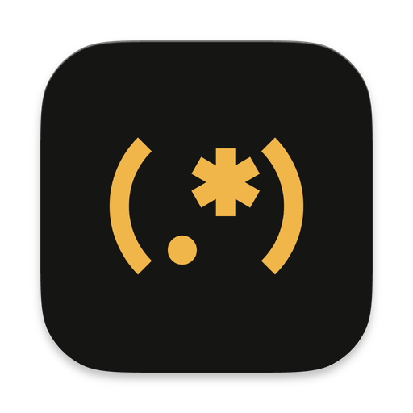
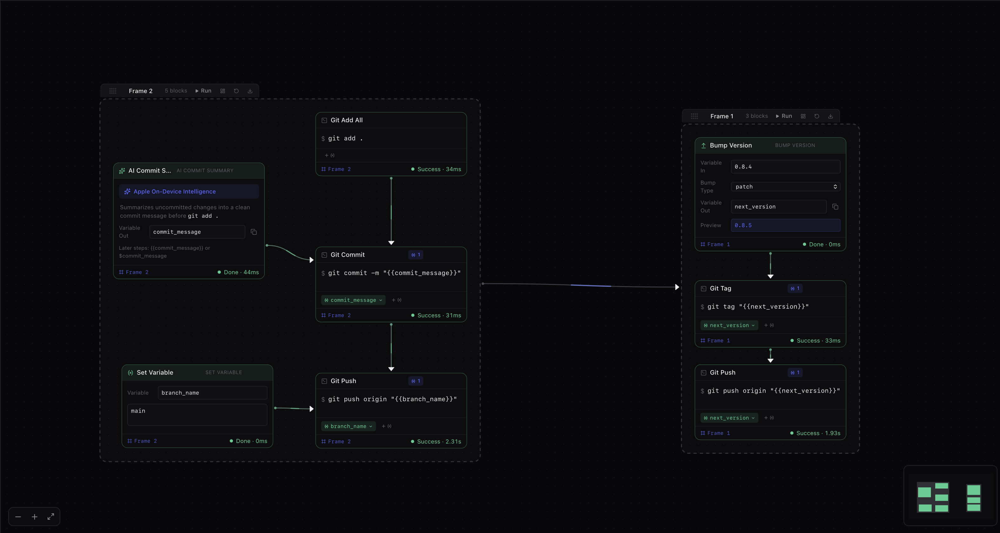

<div align="center">



# Fuse

### Visual Command & Workflow Builder for macOS

[](https://github.com/VladB-evs/Fuse/releases)
[](https://github.com/VladB-evs/Fuse)
[](https://tauri.app)
[](https://www.rust-lang.org/)
[](LICENSE)

<p align="center">
  <b>Draw your terminal commands as connected blocks on an infinite canvas.</b><br/>
  Orchestrate complex shell scripts, APIs, git workflows, and automated pipelines with real-time streaming output, smart variables, and Apple on-device intelligence.
</p>

<p align="center">
  <a href="#key-features">Key Features</a> •
  <a href="#quick-start">Quick Start</a> •
  <a href="#block-catalog">Block Catalog</a> •
  <a href="#variables--flow">Variables & Flow</a> •
  <a href="#keyboard-shortcuts">Shortcuts</a> •
  <a href="#architecture">Architecture</a>
</p>

---



<p><em>(the actual image of the worlflow used for this app)</em></p>

</div>

---

## ⚡️ Key Features

- 🎨 **Fluid Canvas Orchestration** — Built for speed. Add blocks with a keystroke, drag wires between ports, and let frames auto-resize around their contents.
- 🦀 **Native Rust Performance** — Zero Electron bloat. Powered by **Tauri 2** and Tokio async DAG walk. Sub-50MB memory footprint with instant launch times.
- 🧠 **Apple On-Device Intelligence** — Analyze git diffs locally using on-device semantic summaries to generate conventional commit messages in milliseconds.
- 📁 **Repository & Folder Frames** — Group blocks inside folder frames. Every block inside automatically runs in that repository's directory, letting you drive multiple projects from one graph.
- 🔗 **Smart Variable Inheritance** — Upstream values (`{{version}}`, `{{commit_message}}`, `{{sha}}`) automatically bind through connections and flow cleanly into downstream shell commands, scripts, or API requests.
- 🎛 **Interactive Human-in-the-Loop** — Pause for confirmation (**Confirm**), branch dynamically (**If / Else**, **Choose**), or prompt for runtime tokens (**Ask**) mid-run.
- 📟 **Real-Time ANSI Terminal** — Full 256-color & truecolor ANSI escape sequence streaming. Highlights errors, success states, and structured output with one-click clipboard copying.

---

## 🚀 Quick Start

### Prerequisites

- macOS 13+ (Apple Silicon & Intel)
- [Node.js](https://nodejs.org/) (v18+)
- [Rust](https://www.rust-lang.org/tools/install) (latest stable)

### Download & Installation

Download the latest `.dmg` or `.app` release from [GitHub Releases](https://github.com/VladB-evs/Fuse/releases/latest).

> [!TIP]
> **macOS Gatekeeper Note**: If macOS displays *"App is damaged and can't be opened"* on an unsigned release, run this single command in Terminal to clear the download quarantine flag:
> ```bash
> xattr -cr /Applications/Fuse.app
> ```
> Or **Right-click / Control-click** `Fuse.app` in Finder and select **Open**.

### Development Setup

```bash
# Clone the repository
git clone https://github.com/VladB-evs/Fuse.git
cd Fuse

# Install dependencies
npm install

# Run in development mode (starts Vite + Tauri)
npm run tauri dev
```

### Building from Source

```bash
# Package a production macOS .dmg / .app bundle
npm run tauri build
```

The compiled release will be available under `src-tauri/target/release/bundle/dmg/`.

---

## 🧱 Block Catalog

Fuse provides a rich library of blocks for scripting, automation, flow control, and data pipeline transformations:

### 1. Execution
| Block | Description | Example |
| :--- | :--- | :--- |
| **Command** | Executes a shell line with full pipe, glob, and environment support. | `npm test && npm run build` |
| **Script** | Multi-line code block running directly in Python, Node.js, Bash, Ruby, etc. | `python3 script.py` |
| **HTTP Request** | Performs REST / API requests (`GET`, `POST`, `PUT`, `DELETE`) and captures the response. | `POST https://api.github.com/...` |

### 2. Git & Automation
| Block | Description | Example |
| :--- | :--- | :--- |
| **AI Commit Summary** | Uses on-device intelligence to summarize uncommitted diffs into standard commit messages. | `git diff -> {{commit_message}}` |
| **Bump Version** | Increments semantic version strings (`major`, `minor`, `patch`) from variables or files. | `v1.2.3 -> v1.2.4` |
| **Git Presets** | Pre-built templates for `Init`, `Clone`, `Commit & Push`, `Rebase`, `Sync`, and `Tag`. | `git tag "{{next_version}}"` |

### 3. Values & Data Pipelines
| Block | Description | Example |
| :--- | :--- | :--- |
| **Capture** | Executes a command and captures its standard output into a reusable variable. | `git rev-parse --short HEAD -> {{SHA}}` |
| **Set Variable** | Assigns or combines strings and existing variables for downstream consumption. | `Set {{url}} = https://{{domain}}` |
| **Read File** | Reads a local file from disk directly into a workflow variable. | `Read package.json -> {{pkg}}` |
| **Write File** | Writes content or substituted variables into a target file on disk. | `Write {{api_response}} to dist/data.json` |
| **Ask** | Prompts the user for runtime values (with secret masking support). | `Enter deploy token:` |

### 4. Logic & Flow Control
| Block | Description | Example |
| :--- | :--- | :--- |
| **If (Condition)** | Evaluates a test command: exit `0` takes the bottom path; any other exit takes the right path. | `test -f dist/index.js` |
| **Choose** | Pauses mid-run and prompts the user to select which outgoing path(s) to execute. | `[Deploy Staging] or [Deploy Prod]` |
| **Confirm** | Safety gate: displays output transcript so far and halts unless approved. | `Proceed with release? (Yes / No)` |
| **Wait** | Implements delays or actively polls a healthcheck command until it succeeds. | `Wait until: curl -fsS localhost:3000` |
| **Frame** | Visual container grouping blocks under a dedicated working directory. | `~/Projects/backend` |

---

## 💡 Variables & Smart Piping

### Substituted & Environment Variables
Values produced by any upstream block are stored in the workflow execution scope. You can reference them anywhere:

```bash
# In shell command templates:
git tag "{{next_version}}"
git commit -m "{{commit_message}}"

# In scripts, URLs, and JSON payloads:
https://api.example.com/v1/deployments/{{SHA}}

# Directly in the shell as exported environment variables:
echo "Deploying version $next_version on branch $branch_name"
```

### Shell-Safe Escaping
Fuse automatically handles quoting based on where data is inserted:
- **Shell Commands** receive safe shell quoting, preventing space-splitting, unescaped quotes, or unintended parameter expansions.
- **Scripts and HTTP Payloads** receive verbatim values, preserving pristine JSON, Python indentation, and multiline formatting.

---

## ⌨️ Keyboard Shortcuts

| Shortcut | Action |
| :--- | :--- |
| <kbd>Tab</kbd> | Open Block Picker at cursor location |
| <kbd>A</kbd> | Add Command Block at cursor location |
| <kbd>F</kbd> | Add Folder Frame at cursor location |
| <kbd>Double Click</kbd> | Quick-create a Command Block on canvas |
| <kbd>⌘</kbd> + <kbd>K</kbd> | Open Command Palette (Workflows, Presets, Settings) |
| <kbd>⌘</kbd> + <kbd>Enter</kbd> | Run entire workflow |
| <kbd>⌘</kbd> + <kbd>.</kbd> | Stop active execution |
| <kbd>Shift</kbd> + <kbd>Drag</kbd> | Multi-select blocks with selection marquee |
| <kbd>Shift</kbd> + <kbd>Backspace</kbd> | Cut all wires attached to selected blocks |
| <kbd>Backspace</kbd> / <kbd>Delete</kbd> | Delete selected blocks or frames |

---

## 🛠 Architecture & Tech Stack

```
┌─────────────────────────────────────────────────────────┐
│                    React 19 + Vite                      │
│      @xyflow/react • TailwindCSS • Lucide Icons        │
└────────────────────────────┬────────────────────────────┘
                             │ Tauri 2 IPC (JSON-RPC)
┌────────────────────────────▼────────────────────────────┐
│                    Rust Engine (Tauri 2)                │
│    Tokio Process Groups • Stream Channels • DAG Walker  │
│         Apple On-Device Semantic Summarizer             │
└─────────────────────────────────────────────────────────┘
```

- **Frontend**: React 19, TypeScript, XYFlow (React Flow), TailwindCSS.
- **Backend Core**: Rust, Tokio asynchronous runtime, portable process group handling, ANSI terminal parser.
- **Isolation**: Each frame spawns child processes strictly bounded to its configured directory with isolated environment contexts.

---

## 🤝 Contributing

Contributions, bug reports, and feature requests are welcome!

1. Fork the repository
2. Create your feature branch (`git checkout -b feat/amazing-feature`)
3. Commit your changes (`git commit -m 'feat: add amazing feature'`)
4. Push to the branch (`git push origin feat/amazing-feature`)
5. Open a Pull Request

---

## 📄 License

Distributed under the MIT License. See [LICENSE](LICENSE) for details.
